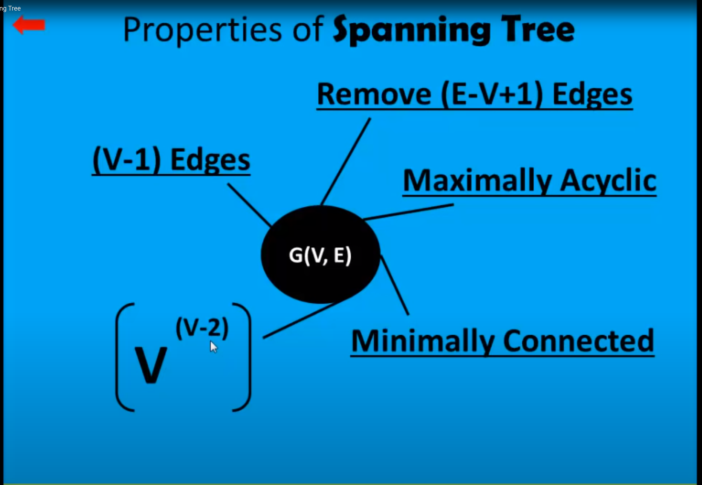

# GRAPHS
A Graph has edges and vertices connected between different nodes
## Spaning trees
It is a tree that contains all the vertices of a connected and undirected graph
#### Spanning tree of a graph has (V-1) Edges

#### To find spanning tree remove (E-V+1) Edges

#### Spanning tree has {V^(V-2)}

#### Maximally Acyclic = Add an edge to a spanning tree

#### Minimally Connected = Remove one edge from the spanning tree



### KRUSKAL'S ALGORITHM: Find minimum cost of a spanning tree
Start from the node with the nodes with the least costing edge. Proceed with the edge that gives the next least cost avoiding any edge that forms a cyclic connrction between two edges
### PRIM'S ALGORITHM: Find minimum cost of a spanning tree

Start from a random node, record the least edge from it. Change to the re4corded node as your starting node then record the least edge avoiding the edge that forms a graph or two paths between two nodes. "We should choose the minimum weight-edge coming out.. out of all EDGES coming out of yet discovered "tree" NOT just the EDGES coming out of the "current node" only"

#### InPut


#### OutPut
```sh
cummulative:  45
next chosen:  B
visited:  [4, 6, 3]
[0, 3, 4]
current node:  B
next_possible_nodes:  ['A']
14
cummulative:  59
next chosen:  A
visited:  [4, 6, 3, 1]
[1, 2, 3]
current node:  A
next_possible_nodes:  ['C']
10
cummulative:  69
next chosen:  C
visited:  [4, 6, 3, 1, 0]
[0, 3, 5]
current node:  C
next_possible_nodes:  ['F']
29
cummulative:  98
next chosen:  F
visited:  [4, 6, 3, 1, 0, 2]
[2, 3, 6]
current node:  F
last node has introduced a second path on already node
next_possible_nodes:  ['C', 'D', 'G']
29
17
25
cummulative:  115
next chosen:  D
visited:  [4, 6, 3, 1, 0, 2, 5]
all_nodes_visited
path No. 1
[3, 4, 5]
current node:  G
next_possible_nodes:  ['D', 'E', 'F']
21
9
25
cummulative:  9
next chosen:  E
visited:  [6]
[1, 3, 6]
current node:  E
next_possible_nodes:  ['B', 'D']
18
16
cummulative:  25
next chosen:  D
visited:  [6, 4]
[0, 1, 2, 4, 5, 6]
current node:  D
next_possible_nodes:  ['A', 'B', 'C', 'F']
19
15
26
17
cummulative:  40
next chosen:  B
visited:  [6, 4, 3]
[0, 3, 4]
current node:  B
next_possible_nodes:  ['A']
14
cummulative:  54
next chosen:  A
visited:  [6, 4, 3, 1]
[1, 2, 3]
current node:  A
next_possible_nodes:  ['C']
10
cummulative:  64
next chosen:  C
visited:  [6, 4, 3, 1, 0]
[0, 3, 5]
current node:  C
next_possible_nodes:  ['F']
29
cummulative:  93
next chosen:  F
visited:  [6, 4, 3, 1, 0, 2]
[2, 3, 6]
current node:  F
last node has introduced a second path on already node
next_possible_nodes:  ['C', 'D', 'G']
29
17
25
cummulative:  110
next chosen:  D
visited:  [6, 4, 3, 1, 0, 2, 5]
all_nodes_visited
Final results:
{'edges': [[6, 4, 9], [4, 3, 16], [3, 1, 15], [1, 0, 14], [0, 2, 10], [5, 3, 17]], 'edges_alias': [['G', 'E', 9], ['E', 'D', 16], ['D', 'B', 15], ['B', 'A', 14], ['A', 'C', 10], ['F', 'D', 17]], 'cummulative_cost': 110, 'visited_nodes': [6, 4, 3, 1, 0, 5], 'visited_nodes_alias': ['G', 'E', 'D', 'B', 'A', 'F']}
Resulting connected network:
[['G', 'E', 9], ['E', 'D', 16], ['D', 'B', 15], ['B', 'A', 14], ['A', 'C', 10], ['F', 'D', 17]]
Result newtwork cost is: 81
maximum saving is: 138
        A       B       C       D       E       F       G
A       -       14      10      19      -       -       -
B       14      -       -       15      18      -       -
C       10      -       -       26      -       29      -
D       19      15      26      -       16      17      21
E       -       18      -       16      -       -       9
F       -       -       29      17      -       -       25
G       -       -       -       21      9       25      -
```